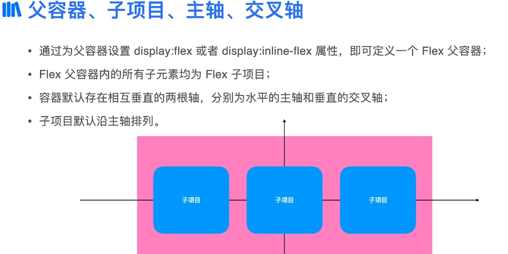
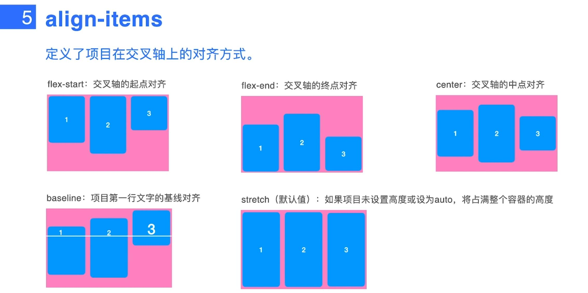

# CSS3

## 选择器
- 多元素选择器   `.a,.b`
- 后代元素选择器 `.c .d`
- 子元素选择器   `div>p` 
- 兄弟元素选择器 `div+p`
- 同级元素选择器 `.a~.p`
- 伪类选择器
	-  `li:nth-child(5)`
	-  `li:last-child`
	-  `li:firset-child`
	-  `li:hover`
- 属性选择器
	- `input[type="password"]`
	- `button[disabled="disabled"]`

## 浮动
```css
/* #desk::after{
	content: '';
	display: block;
	clear: both;
} */

#desk > span {
	display: block;
	clear: both;
}
```

## 定位


demo7


demo8
(如果上级元素有相对定位的 就会更具上级元素定位 反之更具更元素定位)
  

demo9


demo10


## 过渡动画
demo 11
```
div {
	transition: all 1s;
}

div::hover {
	width: 600px;
}
```

## Size
- `100%` 父元素的100%
- `vh vw` 把整个屏幕分成100份
	- `100vh` 高度整个屏幕大小
	- `100vw` 宽度

## 图片 资源处理
- obhject-fit  `demo13`

## 媒体查询 `demo14`
```
@media screen and (max-width: 800px) {
			section {
				float: none;
				width: 100%;
			}
		}
```

## Transform `demo15`
- 水平居中
```
				position: relative;
				left: 50%;
				transform: translateX(-50%);
```
- 垂直居中
```
				top: 50%;
				transform: translateY(-50%);
```

## Filexbox 布局   `demo16`



### 父亲项目可设置属性





### 子项目可设置属性


## 网站布局
- 卡片  `demo18`
- 圣杯  `demo19`
- 固定头部布局  `demo20`
- 固定尾部布局  `demo21`
- 实战 `demo22`